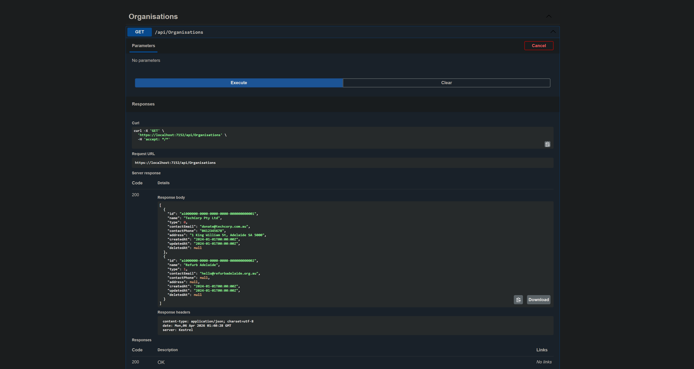
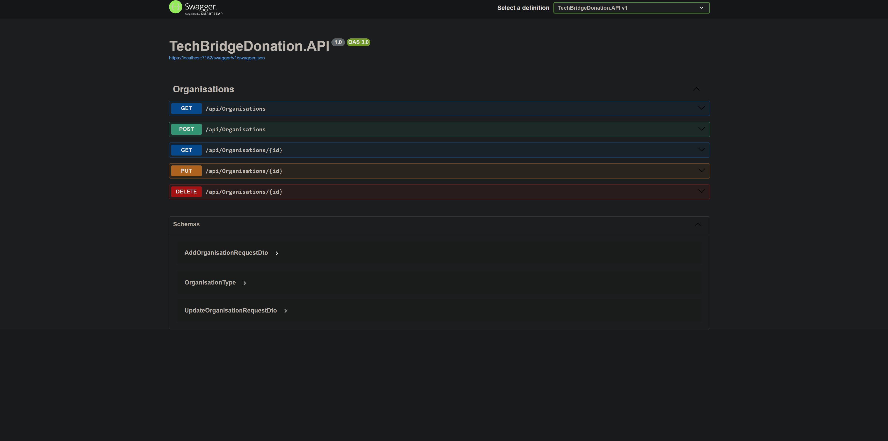

# TechBridge Donation (Backend)

TechBridge is a device donation platform connecting businesses, refurbishers, and schools. This repo is the backend for the Donation module. It provides the REST API, JWT authentication, and database layer used by the React frontend.

[About the TechBridge project](https://tech-bridge-landing-page.vercel.app/) · Donation Module (Frontend Repo) (coming soon) · [Invoice Module Live Demo](https://tech-bridge-invoice-app.vercel.app/) · [Invoice Module (Frontend repo)](https://github.com/ting11222001/TechBridge-Invoice-app) · [Invoice Module (Backend repo)](https://github.com/ting11222001/TechBridge-Invoice)

## Demo

`GET /api/organisations`, seeded data returned from PostgreSQL:

Swagger endpoint list:

## Table of Contents

- [What This Platform Does](#what-this-platform-does)
- [Roles and Users](#roles-and-users)
- [Tech Stack](#tech-stack)
- [What's Built](#whats-built)
- [Engineering Highlights](#engineering-highlights)
- [In Progress](#in-progress)

## What This Platform Does

**Device Donation Management**

Manages the full journey of a donated device: from submission and 
approval, through certified data wiping and refurbishment, to final 
allocation via a partner school or NGO. Schools submit requests on 
behalf of students. The platform matches, tracks, and records every 
device at each step.

- Device lifecycle with enforced status transitions (no skipping, 
  no going backwards)
- Role-based access for all four partner types
- Audit trail for every status change
- Admin-controlled matching and allocation

**Who uses it:**
Business Donor · Refurb Partner · School / NGO · Admin

## Roles and Users

There are four user roles in the system:

| Role | Who | What they can do |
|---|---|---|
| Admin | Program operators | Approve donations, assign devices, match requests, view audit logs |
| Business Donor | Companies donating devices | Create donations, add devices, view status after approval |
| Refurb Partner | IT recyclers or repair shops | Update wipe and refurb status, add technical notes |
| Request Partner | Schools or NGOs | Submit requests, view status, confirm device receipt |

> Admins can see everything. Everyone else sees only what they own or are assigned to.

## Tech Stack

- ASP.NET Core Web API (.NET 8)
- EF Core + PostgreSQL

## What's Built

- Database tables created via EF Core migrations
- Data seeding and migrations: 
	- Migrations run automatically on startup via `MigrateAsync()`. 
	- Seed data is applied once using existence checks to prevent duplicates.
	- Seeded data for Organisations, Devices, and Donations (also Device Condition, Device Status, Organisation Type, Donation Status)
- Domain models: Device, Donation, Organisation
- DbContext configured with PostgreSQL connection via User Secrets
- CRUD endpoints: Organisations, Devices
- Repository pattern with interfaces
- AutoMapper (domain → DTO)
- Swagger UI with Bearer token support

## Engineering Highlights

- **Async controllers**: All action methods use `async/await`, so the API does not block threads while waiting for the database.
- **DTO layer**: DTOs control what data enters and leaves the API. The flow is `client → DTO → controller → domain model → database`, which keeps the database schema separate from the API contract.
- **Repository pattern**: A repository interface sits between the controller and the database. This separates data access from business logic and makes the code easier to test.
- **Model validation**: Custom validation attributes added directly in the controllers reject bad input before it reaches the database.

## In Progress

- JWT authentication (register + login)
- Role-based authorization (Admin / Viewer)
- Filtering, sorting, pagination on Devices
- React frontend
- Railway deployment